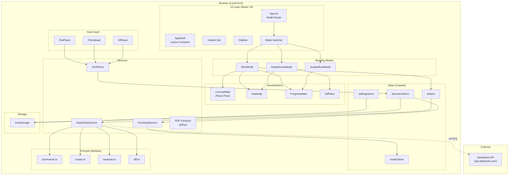
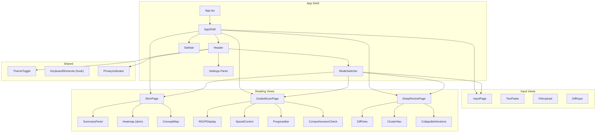
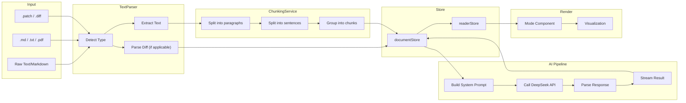

# ReadForge — Technical Architecture

## High-Level Architecture

```mermaid
graph TB
    subgraph "Browser (Local-First)"
        subgraph "UI Layer (React 19)"
            App["App.tsx<br/>Mode Router"]
            Shell["AppShell<br/>Layout Container"]
            Header["Header Bar"]
            Sidebar["Sidebar"]
            ModeS["Mode Switcher"]
        end

        subgraph "Reading Modes"
            SM["SkimMode"]
            GSM["GuidedScanMode"]
            DRM["DeepReviewMode"]
        end

        subgraph "Visualizations"
            CM["ConceptMap<br/>(React Flow)"]
            HM["Heatmap"]
            PM["ProgressMeter"]
            DV["DiffView"]
        end

        subgraph "Input Layer"
            TP["TextPaste"]
            FU["FileUpload"]
            DI["DiffInput"]
        end

        subgraph "State (Zustand)"
            DS["documentStore"]
            RS["readerStore"]
            SS["settingsStore"]
            AS["aiStore"]
        end

        subgraph "Services"
            DCS["DeepSeekService"]
            CS["ChunkingService"]
            TP_S["TextParser"]
            PDF["PDF Extractor<br/>(pdf.js)"]
        end

        subgraph "Prompts (Modular)"
            SP["summarize.ts"]
            CP["cluster.ts"]
            HP["heatmap.ts"]
            DP["diff.ts"]
        end

        subgraph "Storage"
            LS["localStorage"]
        end
    end

    subgraph "External"
        DS_API["DeepSeek API<br/>(api.deepseek.com)"]
    end

    App --> ModeS
    ModeS --> SM
    ModeS --> GSM
    ModeS --> DRM

    SM --> CM
    SM --> HM
    SM --> PM
    GSM --> PM
    DRM --> DV
    DRM --> HM

    TP --> TP_S
    FU --> TP_S
    DI --> TP_S
    TP_S --> DS

    DS --> CS
    CS --> RS

    SM --> AS
    AS --> DCS
    DCS --> SP
    DCS --> CP
    DCS --> HP
    DCS --> DP
    DCS -.->|"HTTPS"| DS_API

    SS --> LS
    DS --> LS
```

## Component Architecture

```mermaid
graph TD
    subgraph "App Shell"
        App["App.tsx"]
        Shell["AppShell"]
        H["Header"]
        SB["Sidebar"]
        MS["ModeSwitcher"]
        SPanel["Settings Panel"]
    end

    subgraph "Input Views"
        IP["InputPage"]
        TextPaste["TextPaste"]
        FileUpload["FileUpload"]
        DiffInput["DiffInput"]
    end

    subgraph "Reading Views"
        Skim["SkimPage"]
        GSM_P["GuidedScanPage"]
        DRM_P["DeepReviewPage"]

        Skim --> Summary["SummaryPanel"]
        Skim --> HeatmapSK["Heatmap (skim)"]
        Skim --> ConceptMap["ConceptMap"]

        GSM_P --> RSVP["RSVPDisplay"]
        GSM_P --> SpeedCtrl["SpeedControl"]
        GSM_P --> Progress["ProgressBar"]
        GSM_P --> CompCheck["ComprehensionCheck"]

        DRM_P --> DiffView["DiffView"]
        DRM_P --> Clusters["ClusterNav"]
        DRM_P --> Collapse["CollapsibleSections"]
    end

    subgraph "Shared"
        TM["ThemeToggle"]
        KB["KeyboardShortcuts (hook)"]
        PI["PrivacyIndicator"]
    end

    App --> Shell
    Shell --> H
    Shell --> SB
    Shell --> IP
    Shell --> Skim
    Shell --> GSM_P
    Shell --> DRM_P
    H --> MS
    H --> TM
    H --> PI
    H --> SPanel
    MS --> IP
    MS --> Skim
    MS --> GSM_P
    MS --> DRM_P
```

## Data Flow

```mermaid
flowchart LR
    subgraph "Input"
        A["Raw Text/Markdown"]
        B[".md / .txt / .pdf"]
        C[".patch / .diff"]
    end

    subgraph "TextParser"
        D["Detect Type"]
        E["Extract Text"]
        F["Parse Diff (if applicable)"]
    end

    subgraph "ChunkingService"
        G["Split into paragraphs"]
        H["Split into sentences"]
        I["Group into chunks"]
    end

    subgraph "AI Pipeline"
        J["Build System Prompt"]
        K["Call DeepSeek API"]
        L["Parse Response"]
        M["Stream Result"]
    end

    subgraph "Store"
        N["documentStore"]
        O["readerStore"]
    end

    subgraph "Render"
        P["Mode Component"]
        Q["Visualization"]
    end

    A --> D
    B --> D
    C --> D
    D --> E
    D --> F
    E --> G
    F --> N
    G --> H
    H --> I
    I --> N

    N --> J
    J --> K
    K --> L
    L --> M
    M --> N

    N --> O
    O --> P
    P --> Q
```

## State Management (Zustand)

```mermaid
graph LR
    subgraph "documentStore"
        rawText["rawText: string"]
        chunks["chunks: TextChunk[]"]
        paragraphs["paragraphs: Paragraph[]"]
        diffData["diffData: DiffData | null"]
        fileMeta["fileMeta: FileMeta"]
        aiSummary["aiSummary: string"]
        aiHeatmap["aiHeatmap: HeatmapItem[]"]
        aiClusters["aiClusters: Cluster[]"]
    end

    subgraph "readerStore"
        mode["mode: 'skim' | 'guided' | 'deep'"]
        wpm["wpm: number"]
        chunkSize["chunkSize: 'word' | '3word' | 'phrase' | 'sentence'"]
        currentIndex["currentIndex: number"]
        isPlaying["isPlaying: boolean"]
        progress["progress: number"]
    end

    subgraph "settingsStore"
        apiKey["apiKey: string"]
        model["model: 'deepseek-chat' | 'deepseek-reasoner'"]
        theme["theme: 'dark' | 'light'"]
        showComprehensionChecks["showComprehensionChecks: boolean"]
    end

    subgraph "aiStore"
        isProcessing["isProcessing: boolean"]
        streamingText["streamingText: string"]
        error["error: string | null"]
    end

    documentStore --> readerStore
    settingsStore --> readerStore
    aiStore --> documentStore
```
