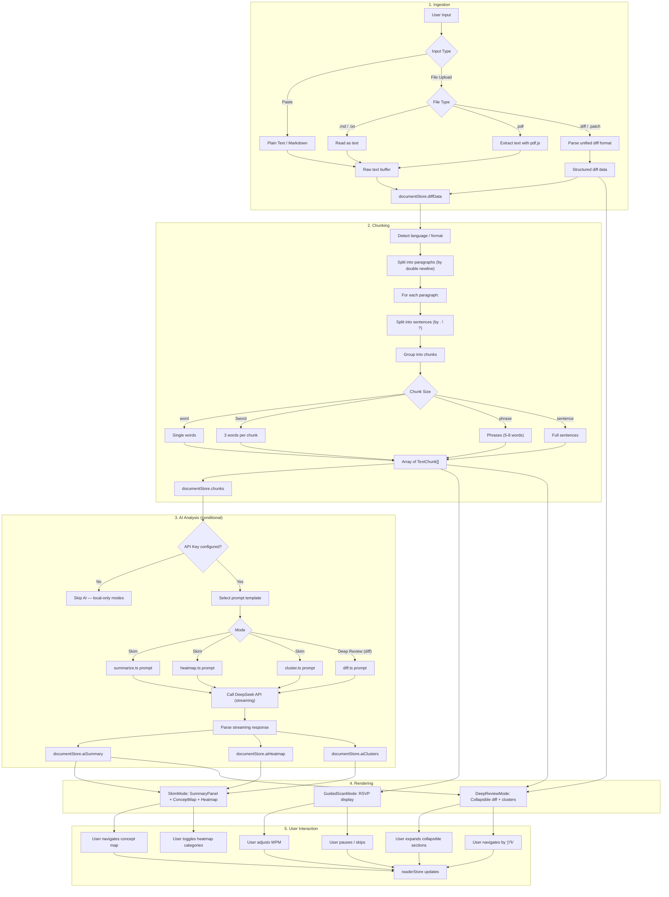
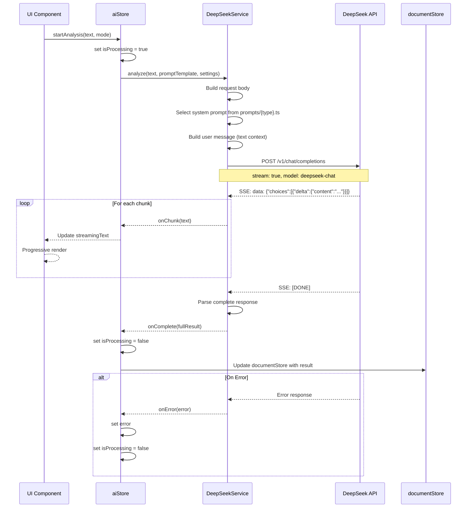
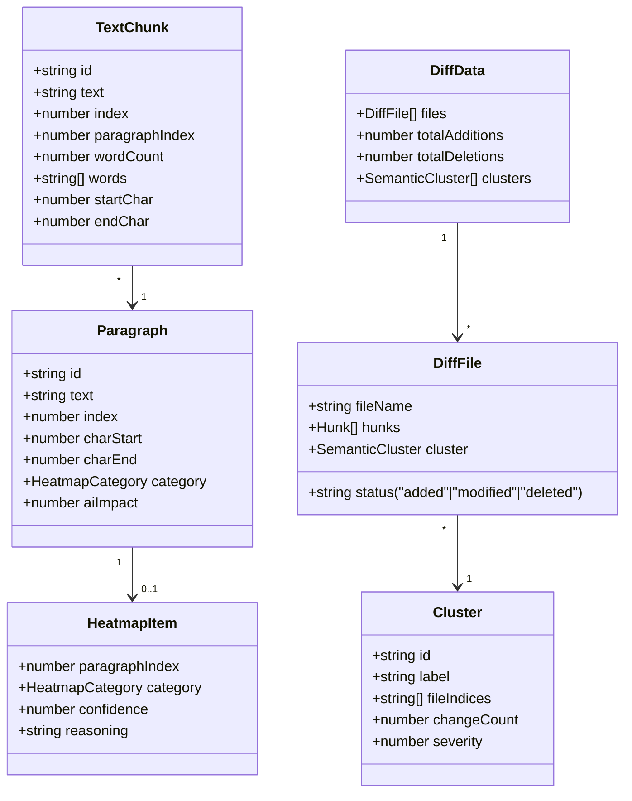

# ReadForge — Data Flow

## End-to-End Text Processing Pipeline

## DeepSeek API Call Flow (Streaming)

## Chunk Data Structure

## Heatmap Categories

| Category | Color (Dark) | Color (Light) | Description |
|---|---|---|---|
| `logic` | `#ef4444` (red) | `#dc2626` | Core business logic, algorithms |
| `ui` | `#3b82f6` (blue) | `#2563eb` | UI components, styling |
| `tests` | `#22c55e` (green) | `#16a34a` | Tests, assertions |
| `security` | `#f59e0b` (amber) | `#d97706` | Auth, permissions, data safety |
| `performance` | `#a855f7` (purple) | `#9333ea` | Performance, optimization |
| `docs` | `#06b6d4` (cyan) | `#0891b2` | Documentation, comments |
| `config` | `#78716c` (stone) | `#57534e` | Configuration, env, setup |
| `other` | `#6b7280` (gray) | `#4b5563` | Uncategorized |
