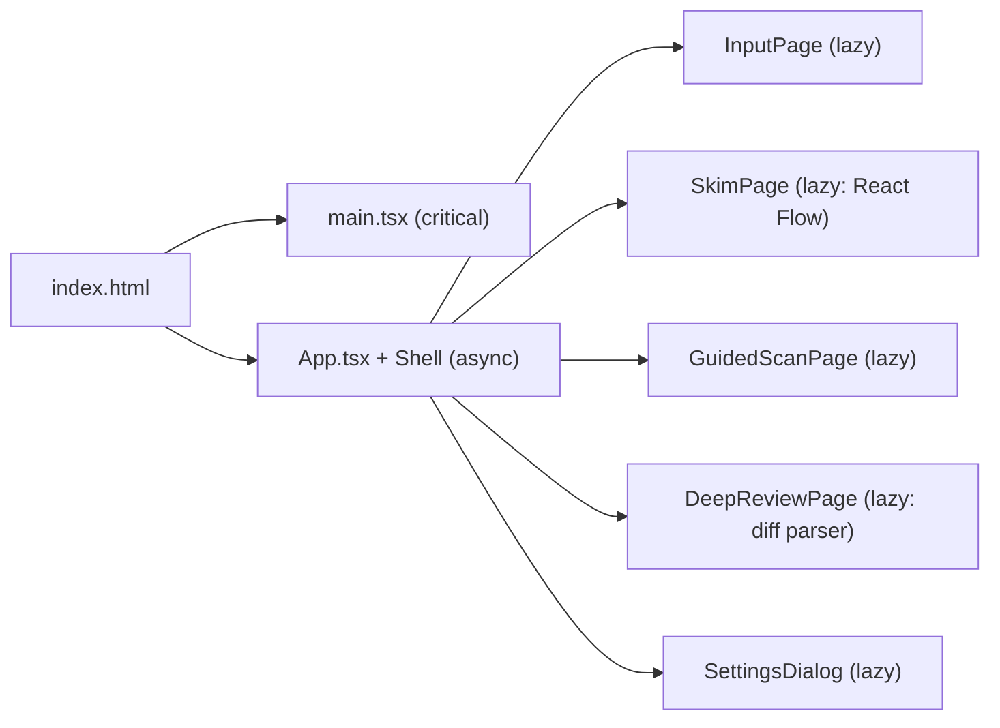

# ReadForge — Non-Functional Requirements

## Performance

| Metric | Target | How We Achieve It |
|---|---|---|
| Initial load (cold) | < 2 seconds | Vite code splitting, lazy load visualization components |
| Initial load (warm) | < 800ms | Browser cache, localStorage persistence |
| Time to interactive | < 500ms after load | Minimal JS bundle (no framework overhead beyond React+Zustand) |
| Chunking 50K words | < 100ms | Pure synchronous JS (simple string ops, no DOM) |
| RSVP frame rate | 60fps | CSS `opacity` transitions, `requestAnimationFrame` timing |
| Concept map render (20 nodes) | < 300ms | React Flow lazy initialization |
| AI streaming latency | first token in < 2s | DeepSeek API streaming mode |
| Memory (typical doc) | < 50MB | No document caching in RAM, chunked processing |

### Loading Strategy

## Accessibility (a11y)

### Standards
- WCAG 2.2 AA compliance target
- Semantic HTML throughout (header, nav, main, section, article)
- ARIA landmarks and roles on all interactive elements
- Focus management: visible focus rings, logical tab order

### Specific Requirements

| Requirement | Implementation |
|---|---|
| Color contrast | 4.5:1 minimum for text (Tailwind ensures this by default) |
| Keyboard navigation | All features accessible without mouse via keyboard shortcuts |
| Screen reader support | ARIA live regions for RSVP chunks, alt text on visualizations |
| Focus indicators | `focus-visible:ring-2` on all interactive elements (Tailwind) |
| Motion reduction | `prefers-reduced-motion` → disable RSVP animation, use static mode |
| Font scaling | `rem` units, support up to 200% zoom without breakage |

### Keyboard Shortcuts (Priority)

| Shortcut | Action | Scope |
|---|---|---|
| `1` | Switch to Input mode | Global |
| `2` | Switch to Skim mode | Global |
| `3` | Switch to Guided Scan mode | Global |
| `4` | Switch to Deep Review mode | Global |
| `Space` | Play/Pause RSVP | Guided Scan |
| `←` / `→` | Back/Forward 1 chunk | Guided Scan |
| `[` / `]` | Back/Forward 10 chunks | Guided Scan |
| `-` / `+` | Decrease/Increase WPM by 50 | Guided Scan |
| `j` / `k` | Next/Previous change | Deep Review |
| `Enter` | Expand/collapse hunk | Deep Review |
| `h` | Toggle heatmap overlay | Skim, Deep Review |
| `s` | Open Settings | Global |
| `?` | Show keyboard shortcuts help | Global |
| `Escape` | Close panel / modal | Global |

## Offline Capability

ReadForge is **local-first by design**:

| Feature | Offline? | Details |
|---|---|---|
| Text paste | ✅ Always | No network needed |
| File upload (.md, .txt, .pdf, .diff) | ✅ Always | All parsing client-side |
| Guided Scan Mode | ✅ Always | Pure client-side RSVP engine |
| Deep Review Mode (no AI) | ✅ Always | Diff parsing + navigation |
| Skim Mode (no AI) | ❌ | Requires AI API call |
| AI-powered analysis | ❌ | Requires DeepSeek API |
| Settings persistence | ✅ Always | localStorage |
| Theme preference | ✅ Always | localStorage |

## Security

| Concern | Mitigation |
|---|---|
| API key leakage | Stored in localStorage only; never logged, never committed, never sent except to configured API endpoint |
| Content privacy | No data sent to any server unless user explicitly configures API key (opt-in) |
| XSS | React's built-in escaping; no `dangerouslySetInnerHTML` except in controlled AI output (sanitized) |
| Local file access | `input[type=file]` only; `FileReader` API; no filesystem access beyond user-selected files |
| Dependency supply chain | Minimal dependencies (see TechStack.md); regular `npm audit` |

## Browser Support

| Browser | Support |
|---|---|
| Chrome 120+ | ✅ Full |
| Firefox 121+ | ✅ Full |
| Safari 17+ | ✅ Full (some PDF features may vary) |
| Edge 120+ | ✅ Full |

## Data Persistence

| Data | Storage | Lifetime |
|---|---|---|
| API key | `localStorage` | Until cleared by user |
| Theme preference | `localStorage` | Until changed |
| WPM setting | `localStorage` | Until changed |
| Current document | RAM (Zustand) | Until page refresh |
| AI analysis cache | RAM (Zustand) | Until page refresh or new doc |
| Last model used | `localStorage` | Until changed |

## Scalability Limits

| Dimension | Limit | Behavior Beyond Limit |
|---|---|---|
| Document size | 100K words | Warning shown; only first 100K analyzed by AI |
| Chunks | 50,000 chunks | Performance degrades gracefully (virtualization needed) |
| Concept map nodes | 50 clusters | Paginated; "Show more" option |
| Diff files | 100 files | Grouped by directory; collapsible |
| Consecutive RSVP | 10,000 chunks | Battery/concentration warning at 5,000 |
