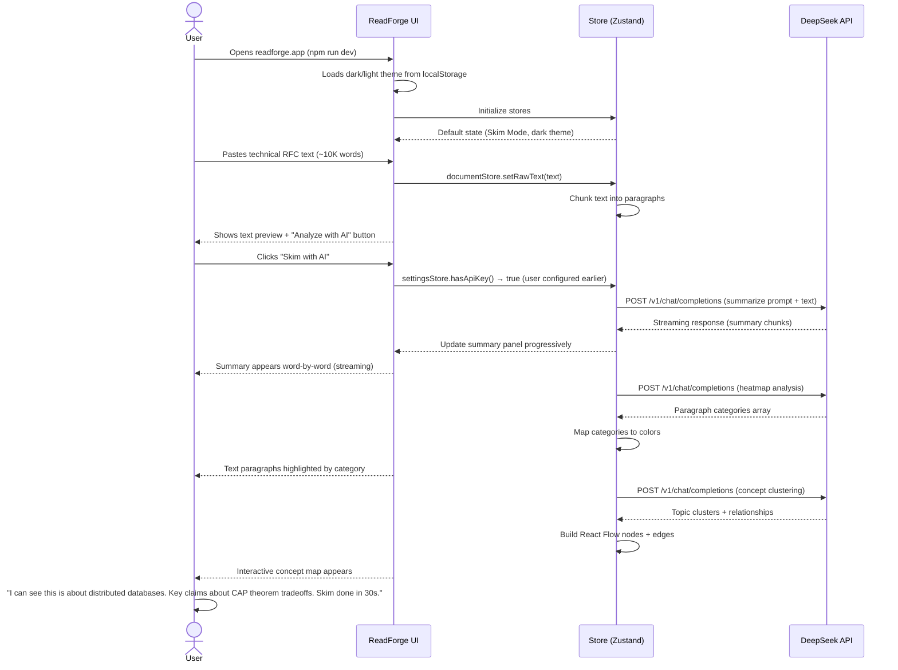
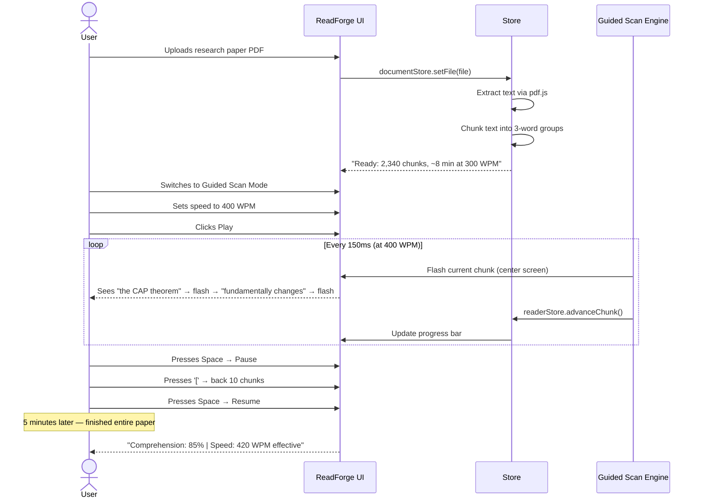
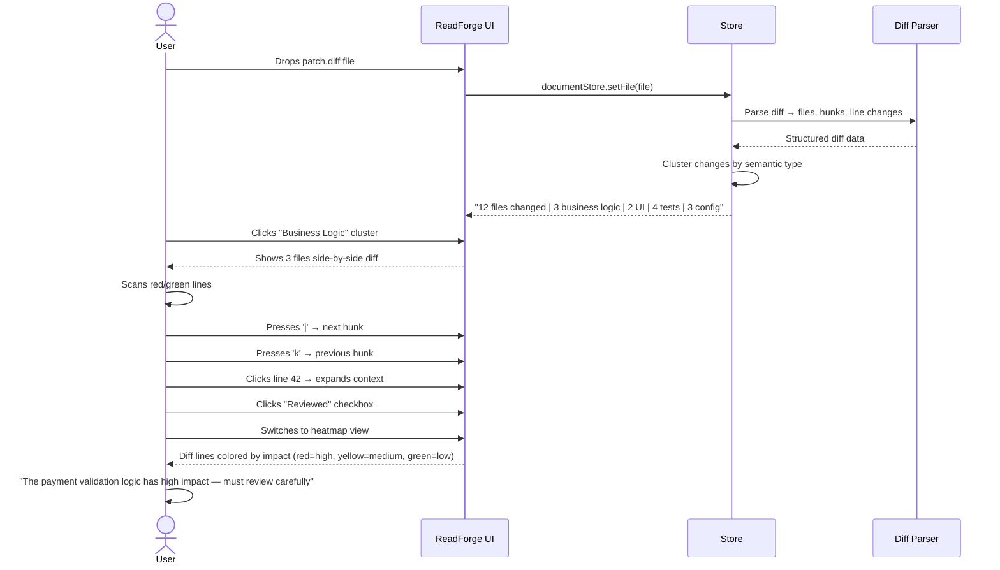
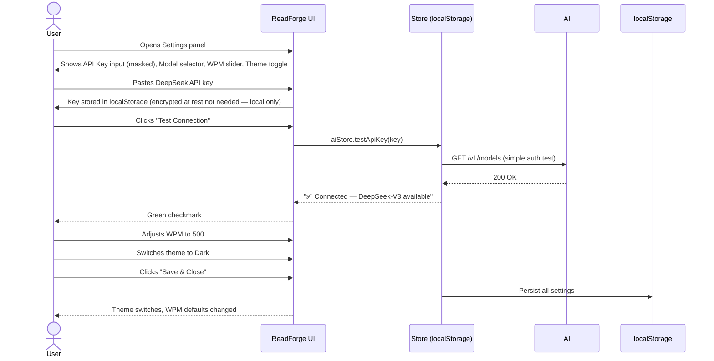
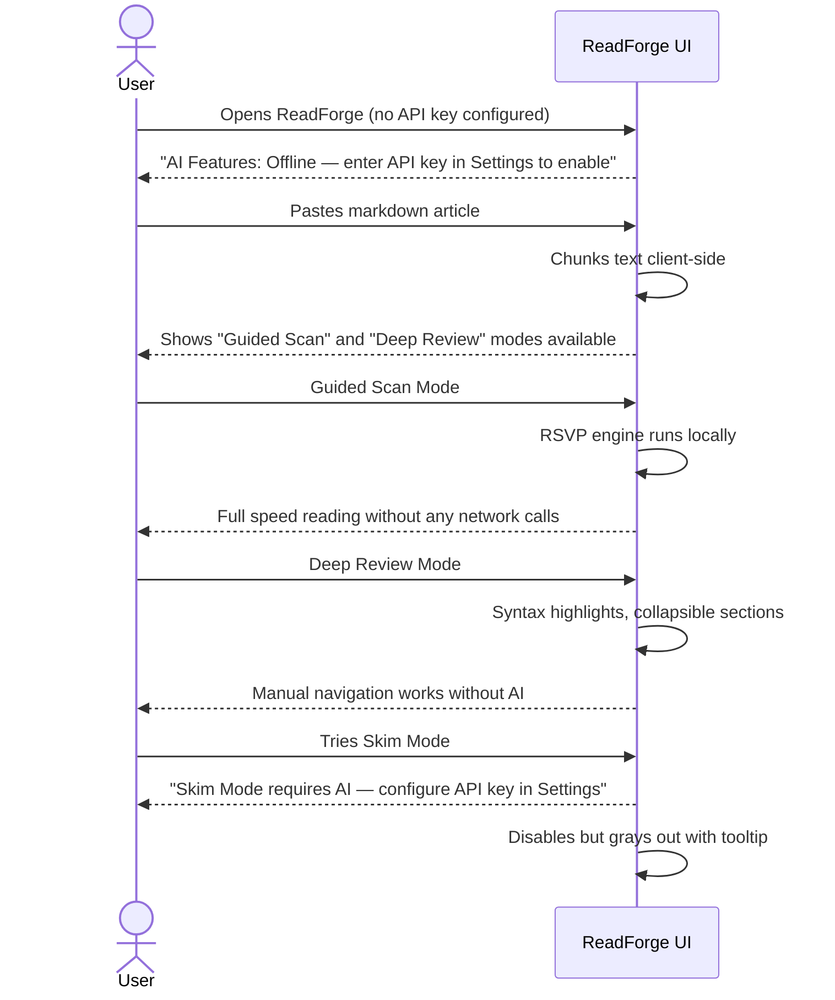

# ReadForge — User Journeys

## Journey 1: First-time User — Onboarding & Skim

## Journey 2: Daily Reading — Guided Scan Mode

## Journey 3: Code Review — Deep Review Mode

## Journey 4: Settings Configuration

## Journey 5: Offline / No-AI Mode

